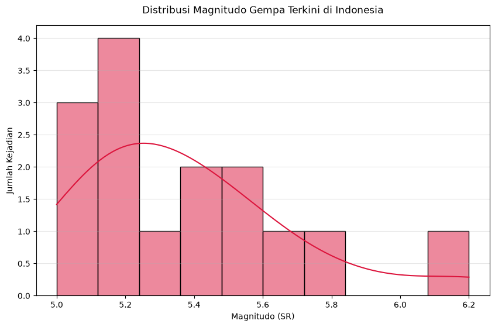
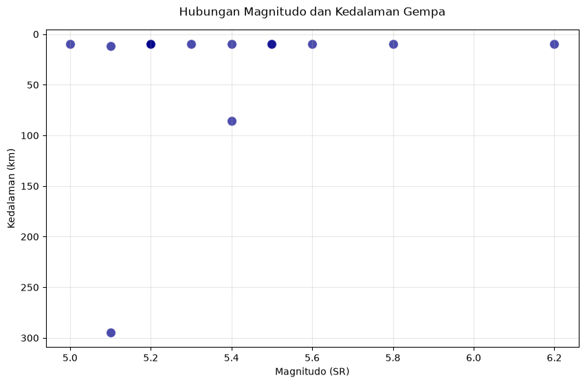

# Analisis Data Gempa Terkini Indonesia

Proyek portofolio data analytics sederhana menggunakan Open Data BMKG (Badan Meteorologi, Klimatologi, dan Geofisika). Script ini secara otomatis mengambil data XML terbaru, mengubahnya menjadi format tabular (CSV), lalu melakukan analisis deskriptif.

## Insight Utama (Berdasarkan 15 gempa terakhir)
- **Gempa Terbesar:** Terjadi dengan magnitudo **6.2 SR** di wilayah **168 km BaratLaut MALUKUBRTDAYA** pada 24 Agu 2026 pukul 21:10:18 WIB.
- **Rata-rata Kekuatan:** Sekitar **5.38 SR**. Mayoritas gempa terkini berada di rentang menengah yang terpantau oleh sistem peringatan dini.
- **Rata-rata Kedalaman:** **34.20 km**. 

## Visualisasi Data

### 1. Distribusi Kekuatan Gempa (Magnitudo)
Melihat sebaran magnitudo dari data gempa terbaru.

### 2. Hubungan Magnitudo vs Kedalaman
Mengetahui apakah ada korelasi antara besarnya gempa dengan kedalaman pusat gempanya. Semakin ke bawah pada grafik, pusat gempa semakin dalam.

## Struktur Folder
- `data/`: Berisi raw dataset `gempa_terkini.csv`.
- `output/`: Berisi hasil visualisasi.
- `analyze.py`: Script penarikan dan analisis data.

## Stack Teknologi
- Python (Pandas, Requests, Matplotlib, Seaborn)
